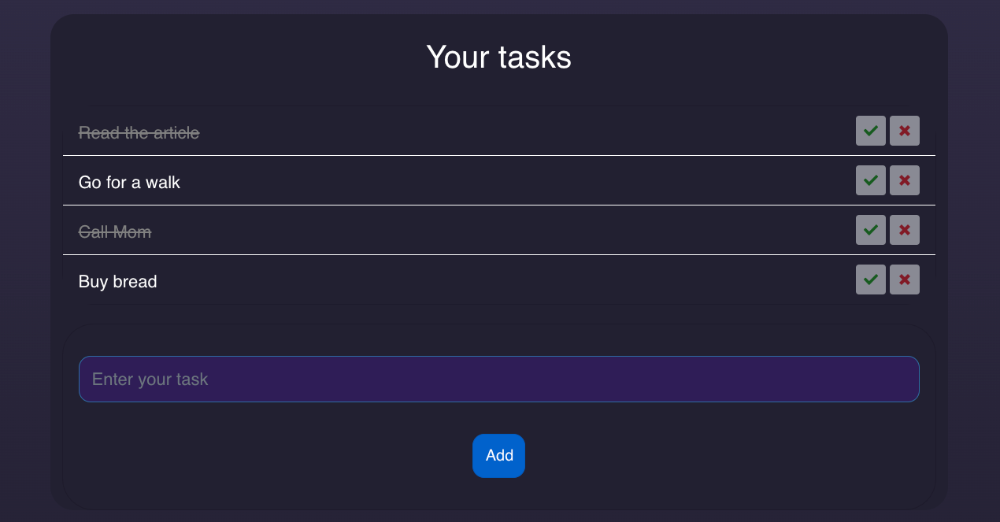

<div align="center">
  <h1><code>Todo list app</code></h1>

<strong>Todo list App</strong>

  <p>
  <a href=""></a>
    
  </p>

_**[Deployed here](https://dmitrygvl.github.io/gameOfLife/)**_

## </div>

## Table of Contents

- [About](#about)
  - [Built with](#built-with)
  - [Rules](#rules)
- [Getting Started](#getting-started)
  - [Prerequisites](#prerequisites)
  - [Installing](#installing)
- [License](#license)

## About <a name="about"></a>

A simple application for recording and managing tasks. Tasks can be added, marked as completed, and deleted.

<div align="center">
  
</div>

### Built with <a name="built-with"></a>

<p align="center"><a href="https://babeljs.io/" target="_blank">
   </a> <a href="https://www.w3schools.com/css/" target="_blank"> 
   </a> <a href="https://git-scm.com/" target="_blank"> 
   </a> <a href="https://www.typescriptlang.org/" target="_blank"> 
   </a> <a href="https://jestjs.io" target="_blank"> 
   </a> <a href="https://eslint.org/" target="_blank"> 
   </a>
  <a href="https://redux.js.org" target="_blank"> 
   </a>
</p>

#### Redux State and Reducers

- **Implementation of clearer task state management:** Allows you to effectively manage the state of tasks in the application.
- **Task Reducers:** Includes the `addTask`, `deleteTask` and `toggleTask` reducers for managing tasks.

#### Local State Saving

- **Save and load state:** Ability to save and load task state to/from `localStorage`, providing convenience and data safety.

#### Initializing State

- **Initialization from `localStorage`:** The `initTasks` reducer is used to initialize the state of tasks from `localStorage`.

#### UI update

- **Synchronizing the task list with the state:** The `updateUI` function ensures that the task list is synchronized with the Redux Store state.

#### Tools

- **Tools Setup:** Jest, ESLint, Webpack, Husky and GitHub Actions are configured and installed to support development.
- **Workflow for CI/CD:** Configured workflow to perform linting, testing and deployment, speeding up the CI/CD process.

### Prerequisites <a name="prerequisites"></a>

:warning: Before installing the project latest version of **npm** should be installed.

```
npm install -g npm@latest
```

### Installing <a name="installing"></a>

1. Clone the repo

```
git clone https://github.com/dmitrygvl/gameOfLife.git
```

2. Install NPM packages

```
npm install
```

3. Start the project

```
npm run start
```

## License <a name="license"></a>

[![MIT License][license-shield]][license-url]

[license-url]: https://github.com/othneildrew/Best-README-Template/blob/master/LICENSE.txt
[license-shield]: https://img.shields.io/github/license/othneildrew/Best-README-Template.svg?style=for-the-badge
